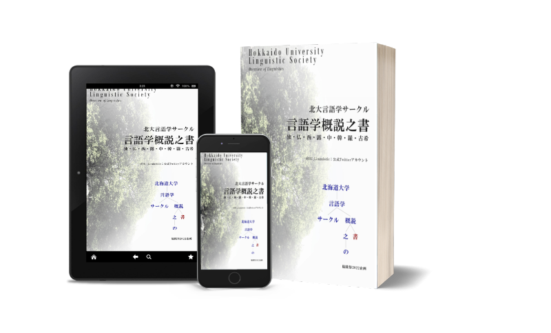

※画像はイメージです

## 『言語学概説之書』 楡陵祭2022

| 媒体 | 場所 | 状況 |
| :-: | :-: | :-: |
| 紙 | 楡陵祭2022 教養棟 E305 | 終了 |
| PDF | [Google Drive](https://drive.google.com/file/d/1eSBjcDgiVpzU9Z1cMRmturJrNpDrx9_G) | 頒布中 |

### 概要

北大の第二外国語として選択可能な,
ドイツ語・フランス語・スペイン語・ロシア語・中国語・韓国語,
そして外国語演習科目として選択可能な言語のうち
ラテン語・古典ギリシア語をあわせた 8 言語の簡単な解説を目的としたもので,
文法面 (形態論・統語論的) での解説を主としております.
言語学にはあまり興味を抱かなかった,
あるいは言語学の知識はそれほどない,
という読者でも読めるように平易な解説につとめております
(したがって「言語学」というよりはむしろ「語学」に近くなっているかと思います).
北大に興味がある高校生や在学している大学生,
また近隣住民の方など様々な方が楡陵祭に来場されるかと思いますが,
どなたでも楽しめるような冊子にするよう心掛けました.

※「はじめに」より抜粋

### 目次

1. はじめに
1. 目次
1. 文法用語解説
1. 世界人権宣言第一条の訳
    1. 日本語
    

    

      第１条
      すべての人間は、生まれながらにして自由であり、かつ、尊厳と権利と について平等である。人間は、理性と良心とを授けられており、互いに同 胞の精神をもって行動しなければならない。
    

      [参考文献](https://www.ohchr.org/en/human-rights/universal-declaration/translations/japanese-nihongo)
    

    1. ドイツ語 / Deutsch
    

    

      Artikel 1
      Alle Menschen sind frei und gleich an Würde und Rechten geboren. Sie sind mit Vernunft und Gewissen begabt und sollen einander im Geist der Brüderlichkeit begegnen.
    

      [参考文献](https://www.ohchr.org/en/human-rights/universal-declaration/translations/german-deutsch)
    

    1. フランス語 / Français
    

    

      Article premier
      Tous les êtres humains naissent libres et égaux en dignité et en droits. Ils sont doués de raison et de conscience et doivent agir les uns envers les autres dans un esprit de fraternité.
    

      [参考文献](https://www.ohchr.org/en/human-rights/universal-declaration/translations/french)
    

    
    1. スペイン語/ Español
    

    

      Artículo 1
      Todos los seres humanos nacen libres e iguales en dignidad y derechos y, dotados como están de razón y conciencia, deben comportarse fraternalmente los unos con los otros.
    

      [参考文献](https://www.ohchr.org/en/human-rights/universal-declaration/translations/spanish)
    

    
    1. ロシア語/ Русский
    

    

      Статья 1
      Все люди рождаются свободными и равными в своем достоинстве и правах. Они наделены разумом и совестью и должны поступать в отношении друг друга в духе братства.
    

      [参考文献](https://www.ohchr.org/en/human-rights/universal-declaration/translations/russian)
    

    
    1. 韓国朝鮮語 / 한국어
    

    

      제 1 조
      모든 인간은 태어날 때부터 자유로우며 그 존엄과 권리에 있어 동등하다. 인간은 천부적으로 이성과 양심을 부여받았으며 서로 형제애의 정신으로 행동하여야 한다.
    

      [参考文献](https://www.ohchr.org/en/human-rights/universal-declaration/translations/korean-hankuko)
    

    
    1. ラテン語 / Latina
    

    

      I
      Omnes homines dignitate et iure liberi et pares nascuntur, rationis et conscientiae participes sunt, quibus inter se concordiae studio est agendum.
    

      [参考文献](https://www.ohchr.org/en/human-rights/universal-declaration/translations/latin-latina)
    

    

※『言語学概説之書』には逐語訳が載っております。ぜひご覧ください。

1. 各言語解説
    1. ドイツ語 / Deutsch
    1. フランス語 / Français
    1. スペイン語/ Español
    1. ロシア語/ Русский
    1. 中国語 / 汉语 (普通话)
    1. 韓国朝鮮語 / 한국어
    1. ラテン語 / Latina
    1. 古典ギリシア語 / Ἑλληνική
